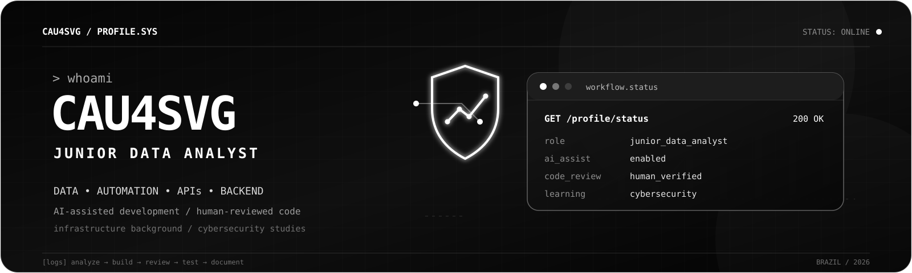

<p align="center">
  
</p>

<p align="center">
  <a href="https://github.com/cau4svg">
    
  </a>
  <a href="https://github.com/cau4svg?tab=repositories">
    
  </a>
</p>

---

## Sobre mim

Sou **Cauã Alves**, desenvolvedor júnior e Analista de Dados Júnior, com experiência anterior em infraestrutura.

Desenvolvo soluções com **Node.js e Python**, principalmente para automatizar tarefas, integrar sistemas e tornar processos mais simples e eficientes.

Utilizo inteligência artificial como apoio durante o desenvolvimento, mas reviso, testo e procuro compreender o código antes de incorporá-lo aos projetos. Minha experiência com infraestrutura também influencia a forma como trabalho: busco criar soluções organizadas, bem documentadas e fáceis de manter.

Atualmente, continuo aprofundando meus conhecimentos em desenvolvimento e estudando fundamentos de cibersegurança, conectando automação, infraestrutura e programação na construção de projetos práticos.

---

## O que faço

```text
01. Desenvolvimento com Node.js e Python
02. Automação de tarefas e processos
03. Integração entre sistemas e APIs
04. Manipulação e organização de dados
05. Suporte e operação de infraestrutura
06. Desenvolvimento assistido por inteligência artificial
