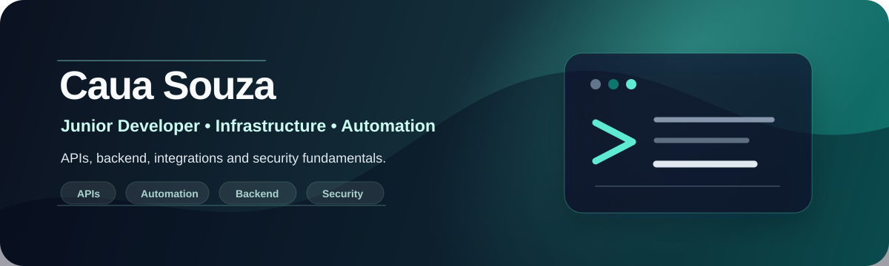

  

 

  
  
  

## About me

I am **Cauã Alves**, a junior developer from Brazil with an infrastructure background and a growing interest in process automation, APIs, backend development, integrations and cybersecurity fundamentals.

I am building my technical base through practical projects, small automations and continuous study. My focus is to solve real operational problems with clear, maintainable and useful technology.

## Current knowledge

| Area | Current level | Focus |
| --- | --- | --- |
| Infrastructure | Intermediate | Linux basics, environments, troubleshooting and operational routines |
| Cybersecurity | Basic | Security fundamentals, safe practices and awareness |
| Development | Junior | Backend logic, APIs, scripts and web fundamentals |
| Process automation | Practicing | Repetitive task reduction, integrations and workflow improvements |

## Technical stack

  

 

  
  
  
  
  
  
  
  

## Knowledge

| --- | --- | --- |
| Planning | Process automation | Build scripts and tools that reduce repetitive operational tasks |
| Practicing | API integrations | Connect services and handle data flows with simple backend logic |
| Studying | Security fundamentals | Apply safer habits in development, infrastructure and automation routines |

## Contact

  

 

  Open to learning, building and collaborating on practical projects involving automation, APIs, backend, infrastructure and security fundamentals.

